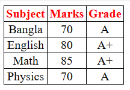

# HTML TABLE  
### HTML Table Tags  
|TAG |DESCRIPTION|
|----|-----------|
|`<table>`|Defines a table|  
|`<th>`|Defines a header cell in a table|  
|`<tr>`|Defines a row in a table|  
|`<td>`|Defines a cell in a table|  
### Output  
  

### Video Tutorial 
[Youtube-Link](https://www.youtube.com/watch?v=RuuS2wQpz7A)  

